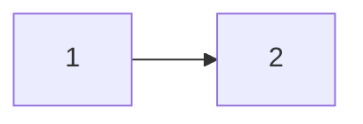

si\#은 Header를 의미합니다.

# H1 태그

## H2 태그

### H3 태그

#### H4 태그

##### H5 태그

\#를 5개 이상 쓰는것은 잘못된 분류!!

---

*hello*

_italic_

**bold**

**_italic+bold_**

~~hello~~

> 이것은 Quote 입니다. 인용문

---

- list 1
- list 2
- list 3
    - A
        - B

1. list 1
2. list 2
3. list 3
    1. A
        2. B

| Title | Description | 비고 |
| ----- | ----------- | ---- |
|표|입니다|이건|

---

링크
[링크이름](naver.com)
<a href="naver.com">링크이름</a>

이미지

이미지설명</img>

---
### 기술블로그에서 code가져오는 법

`simple code`

```cpp
#include <stdio.h>

int main(){
    printf("hello world");
    return 0;
}
```
> 보통 코드는 ```를 이용한다.

```sh
결과출력 hello
```


---
### 수식 편집기
$a^2 + b^2 = c^2$


가운데 정렬은 $$

$$(\alpha + \beta)^2 = \alpha^2 + 2\alpha\beta + \beta^2 $$


---
### 다이어그램


---
